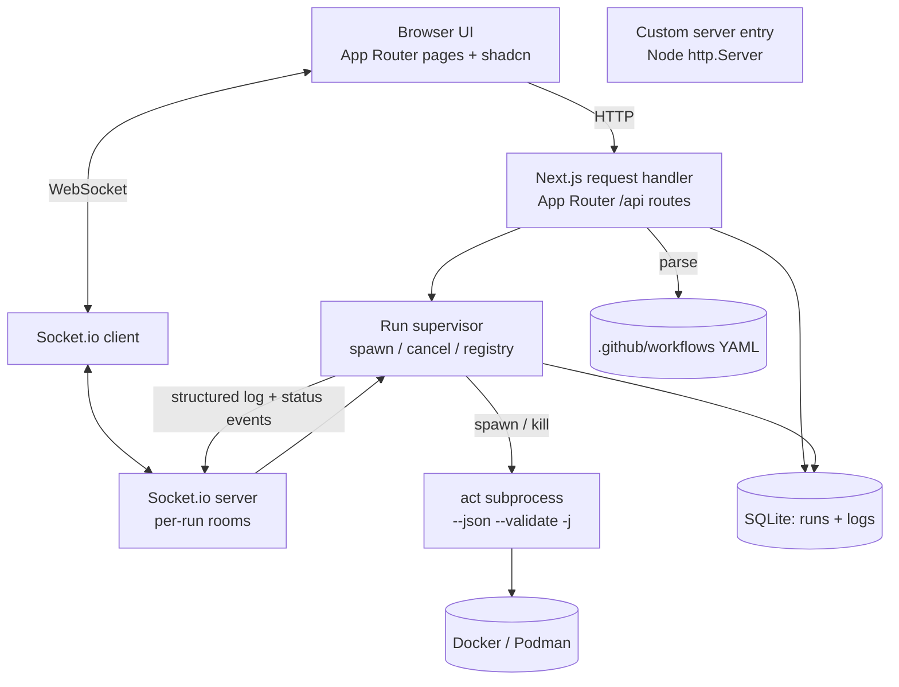
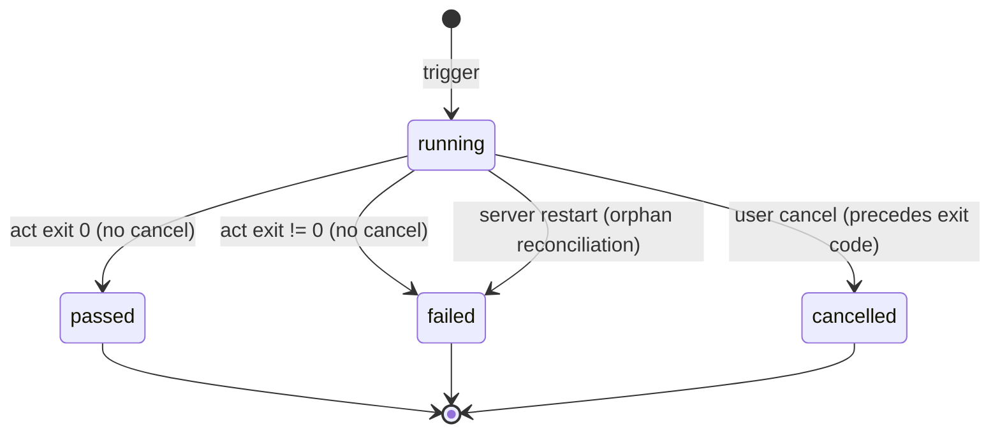
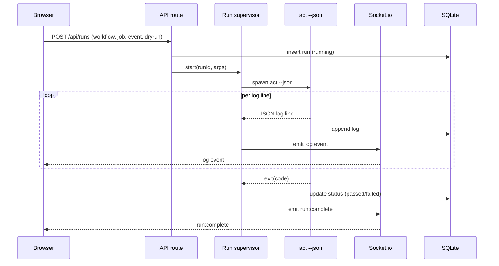

# feat: Act Web UI — local act runner dashboard

## Summary

A local-first Next.js dashboard that wraps the `act` CLI: discover workflows in the current repo, trigger whole-workflow, single-job, or event-simulated runs (with dry-run, cancel, and re-run), stream live per-job/step logs over Socket.io, and keep full-log run history in SQLite. Greenfield build; auth, multi-repo, and a secrets UI are deferred.

## Problem Frame

The team iterates on GitHub Actions workflows before pushing them to GitHub. Today that means running `act` in a terminal — opaque output, no persistent record, logs lost on close, and no history of what ran or whether it passed. This plan implements the dashboard scoped by the origin requirements doc: a repeatable GUI that makes discovery, triggering, live logs, and history first-class and shareable.

---

## Requirements

Carried from the origin doc (`docs/brainstorms/2026-07-09-act-web-ui-requirements.md`); grouped by concern.

**Workflow discovery**

- R1. Discover workflows by reading YAML under `.github/workflows` in the current repo.
- R2. List each workflow with its name, trigger events, and jobs, including job names and declared dependencies.
- R3. Handle malformed YAML gracefully: surface a parse error, still list valid workflows, do not crash.
- R4. Discovery is re-runnable on demand so new or edited workflows appear without a restart.

**Triggering runs**

- R5. Trigger a run of an entire workflow.
- R6. Trigger a run scoped to a single job.
- R7. Choose the event context for a run; at minimum the default `push`, with basic event selection.
- R8. Dry-run validates a workflow without containers or side effects and reports validity.
- R9. Cancel a running run; terminate the `act` subprocess; record a cancelled status.
- R10. Re-run a past run, creating a new run with the same workflow, job, and event parameters.
- R11. If `act` or its container runtime is unavailable at trigger time, fail fast with a diagnostic, never hang.

**Real-time logs**

- R12. Stream run output live to the browser without manual refresh.
- R13. Organize logs per job and per step, not as a flat stream.
- R14. Recover from transient client disconnects: reconnect resumes the stream with no silent loss.
- R15. Capture output server-side so the complete log survives run end and browser closure.

**Run history**

- R16. Persist every run with status (`running`, `passed`, `failed`, `cancelled`), start/end timestamps, and duration.
- R17. Record trigger parameters (workflow, job if scoped, event context) per run.
- R18. Retain full step-level logs per run so any past run is re-readable end to end.
- R19. Derive terminal status from the `act` exit code: zero → `passed`, non-zero → `failed`, user stop → `cancelled`.
- R20. Retain the N most recent runs per repo and prune the oldest beyond the cap (default 50, configurable).

**Testing**

- R21. Unit tests cover the core testable logic of every feature and must pass.
- R22. Specifically unit-test: workflow YAML parsing and job/event extraction; run lifecycle and status transitions; `act` invocation construction; `act` output parsing into jobs and steps; run-history persistence and retrieval; retention pruning.
- R23. Every acceptance example AE1–AE12 is exercisable end to end.

**Cross-cutting**

- R24. Detect at startup whether `act` is installed and surface a clear error if missing.
- R25. Assume a container runtime (Docker or Podman); report its absence as a run failure with guidance.
- R26. Build the UI with Next.js App Router, TypeScript, Tailwind CSS, and shadcn/ui.
- R27. Avoid baking localhost-only assumptions into request handling so a later shared-server + auth path is additive.

---

## Key Technical Decisions

- KTD1. **Custom Node server hosts Next.js and Socket.io on one HTTP port.** The App Router has no native WebSocket support, so a programmatic Next server (`next({ dev })` → request handler) is wrapped in an `http.Server`, and Socket.io attaches to that same server. This keeps the request handler, the run supervisor, and the log stream in one process. Tradeoff: production must run via the custom entry rather than `next start`, which is acceptable for a local-first tool.
- KTD2. **Embedded SQLite (`better-sqlite3`) for run history and full logs.** Durable across restarts, zero-server, and well-suited to the insert / list / prune access patterns and full-log volume. Keep-last-N pruning bounds growth. Alternative considered: a JSON-file store, which is simpler but weaker for log volume, concurrent writes, and pruning.
- KTD3. **Stream logs from `act --json`.** act emits structured JSON log lines carrying job and step context; parsing JSON is robust where regex on colored text is fragile. `--json` is verified present on the installed act 0.2.89. Lines that are not valid JSON pass through raw so no output is lost.
- KTD4. **Discovery parses workflow YAML directly (`js-yaml`), not `act --list`.** Direct parsing yields full structure — job names, `needs` dependencies, steps, and all three forms of `on:` (string, array, map) — instantly, without spawning a subprocess. `act --list` does not expose the job-dependency graph. `act` is reserved for validation and execution.
- KTD5. **Dry-run uses `act --validate` (optionally `--strict`).** `--validate` checks workflow schema validity and exits without running or creating containers, which is the precise fit for R8. (`-n/--dryrun` is the no-container-run alternative; `--validate` is pure validation.)
- KTD6. **Run supervisor is an in-process registry of `act` subprocesses; concurrent runs allowed, no cap; cancel via process-tree kill.** Matches the brainstorm's concurrency decision. Terminal status is **cancel-intent-first and written once**: a cancel requested for a run resolves to `cancelled` regardless of the exit code (a signal-killed `act` exits null/non-zero, which pure exit-code mapping would misread as `failed`); only when no cancel is requested does `code===0 → passed`, else `failed`. The first terminal write wins and any later cancel or exit callback is a no-op. Note: act's own `--concurrent-jobs` controls job parallelism *within one invocation* and is orthogonal to concurrent *runs* (separate act processes).
- KTD7. **Secrets: no in-app manager in the MVP.** act reads a `.secrets` file by default; workflows needing secrets rely on that or `--secret` / environment until a secrets UI is built (deferred). Prefer the `.secrets` file form over inline `-s`/`--secret` flags so secret values do not appear in the process argument vector.
- KTD8. **Test framework: Vitest.** Native TypeScript/Vite, fast, fits the Next + TS stack. Jest is the alternative; either satisfies R21–R23.
- KTD9. **Local-first hardening (not auth).** The server is unauthenticated and the local browser can drive it, so baseline controls enforce the local-first posture without adding auth: bind the HTTP server to `127.0.0.1` by default (Node otherwise listens on `0.0.0.0`); reject cross-origin state-changing requests via an Origin/Host allowlist on POST routes; resolve workflow/job/event strictly against discovery output and pass the vector via `execFile` (an argument array, never a shell string); and restrict Socket.io to the dashboard origin. A non-loopback host is an explicit opt-in gated on auth.

---

## High-Level Technical Design

### Component architecture

### Run lifecycle

### Trigger-and-stream sequence

*Invariants: the terminal status write happens after stdout `end` (Node ordering) and is written once — cancel-intent takes precedence over the exit code (KTD6). Synchronous per-line append (KTD2) guarantees no log line is persisted after the status write.*

---

## Implementation Units

Units are grouped into three phases. Within a phase, units may be built in parallel; phases are ordered by dependency. Together they cover the origin's flows F1–F5: discover (F1) in U3/U5/U7, trigger (F2) in U4/U5/U7, watch-live (F3) in U6/U7, cancel (F4) in U4, and revisit/re-run (F5) in U5/U8.

### Phase A — Foundation

### U1. Project scaffold, tooling, and custom server entry

- **Goal:** Stand up the Next.js App Router + TypeScript + Tailwind + shadcn/ui project with the custom server entry and environment detection.
- **Requirements:** R24, R26, R27.
- **Dependencies:** none.
- **Files:** `package.json`, `tsconfig.json`, `next.config.mjs`, `tailwind.config.ts`, `postcss.config.mjs`, `components.json`, `server.ts`, `lib/env/act-detect.ts`, `lib/env/act-detect.test.ts`, `app/api/health/route.ts`, `vitest.config.ts`, `.env.example`.
- **Approach:** Initialize Next with the App Router and TypeScript; add Tailwind and shadcn/ui. The custom server entry creates an `http.Server`, prepares Next for the correct `dev`/`prod` mode, obtains the request handler, attaches Socket.io (the Socket.io server itself is built in U6; here only the attachment seam is reserved), and listens on one port bound to `127.0.0.1` by default (KTD9). `next.config.mjs` marks `better-sqlite3` as a server-external package so the App Router build does not try to bundle the native addon. `act-detect` resolves whether `act` is on `PATH` and whether a container runtime is reachable, returning a structured availability result used by `/api/health` and by the supervisor's fail-fast path. Run scripts invoke the custom entry (e.g., via `tsx`) rather than `next dev`/`next start`. The entry reserves a boot hook for stale-run reconciliation; the reconcile operation and its wiring are provided by U2 (so U1 does not depend on U2), keeping no run stuck in `running` after a crash or restart.
- **Test scenarios:**
  - `act-detect` returns `installed` when `act` resolves on `PATH`, and `missing` when it does not.
  - `act-detect` reports container-runtime availability distinctly from the act binary.
  - `/api/health` returns the combined act + container availability.
- **Verification:** the custom server boots on a single port and serves the Next app; `/api/health` reflects the local environment.

### U2. Persistence layer

- **Goal:** Provide durable run and log storage with keep-last-N pruning.
- **Requirements:** R16, R17, R18, R20.
- **Dependencies:** none (consumed by U4, U5, U6).
- **Files:** `lib/db/index.ts`, `lib/db/schema.ts`, `lib/db/runs-repo.ts`, `lib/db/runs-repo.test.ts`, `lib/db/prune.test.ts`.
- **Approach:** Open a SQLite database (path configurable, default under a local data dir) via `better-sqlite3`. Schema covers a `runs` table (id, workflow, job, event, status, started_at, ended_at, duration_ms, params) and a `run_logs` table (run_id, seq, job, step, level, message, ts) keyed for ordered retrieval. The repository exposes insert-run, append-log, list-runs, get-run-with-logs, update-status, and a prune-to-N operation. Logs are appended synchronously (better-sqlite3's default) and incrementally, so they survive crashes and can be replayed on reconnect (R14/R15); synchronous per-line append is load-bearing because it flushes every log before the terminal status write, keeping replay deterministic. Schema initialization is idempotent. The repository also exposes a `reconcile-stale-runs` operation that, on boot, marks rows still in `running` as terminal — reusing `failed` and appending one diagnostic log line (run interrupted: server restarted before act exited) rather than adding a fifth status. Pruning considers only rows in a terminal status, so a live run is never deleted out from under the supervisor. `better-sqlite3` is a native module: `lib/db` imports are confined to the server entry, route handlers, and the supervisor; client components reach data only through the typed API client. The SQLite database path defaults to a location outside the repository and is gitignored, because persisted logs may contain secret values printed by steps. U2 owns wiring the `reconcile-stale-runs` call into the server entry's boot hook.
- **Test scenarios:**
  - Insert a run; retrieve it with status, timestamps, and duration.
  - Append log lines out of order by sequence; retrieve them ordered per run.
  - Keep-last-N: after N+1 runs, the oldest run and its logs are pruned; recent runs remain; a row still in `running` is never pruned. (Covers AE10.)
  - Retention N is read from configuration and overrides the default.
  - Initialization is idempotent across restarts (re-open does not error or duplicate).
  - `reconcile-stale-runs` marks a `running` row as `failed` on boot and appends a diagnostic log line.
- **Verification:** the repository round-trips runs and full logs and enforces the retention cap.

### U3. Workflow discovery

- **Goal:** Parse `.github/workflows` into structured workflow/job/event data, robust to bad input.
- **Requirements:** R1, R2, R3, R4.
- **Dependencies:** none (consumed by U5, U7).
- **Files:** `lib/discovery/types.ts`, `lib/discovery/parse-workflows.ts`, `lib/discovery/parse-workflows.test.ts`, `lib/discovery/index.ts`.
- **Approach:** Read `.github/workflows/*.{yml,yaml}` from the configured repo path and parse each with `js-yaml`. For each workflow extract the display name, trigger events from `on:` (handling string, array, and map forms), and jobs with their ids, names, `needs` dependencies, and step list. A parse failure for one file is captured as a per-file error result and does not abort the rest; the caller still receives valid workflows plus the error list. Discovery is a pure function over the filesystem so it can be re-invoked for refresh (R4) without state.
- **Test scenarios:**
  - A repo with two valid workflows yields both, each with name, events, jobs, and `needs` dependencies.
  - `on:` as a string, as an array, and as a map all yield the correct event set.
  - A malformed YAML file is surfaced as a per-file error while valid files still list. (Covers AE2.)
  - An empty `.github/workflows` directory yields an empty list with no error.
  - Re-running discovery after a workflow is added returns the new workflow. (Covers AE12.)
- **Verification:** discovery returns structured workflows and isolates invalid files.

### Phase B — Execution core

### U4. Run supervisor (act engine)

- **Goal:** Spawn and supervise `act` runs: build the invocation, capture and parse output, derive status, support cancel, and fail fast on missing prerequisites.
- **Requirements:** R5, R6, R7, R8, R9, R11, R13, R15, R19, R25.
- **Dependencies:** U2 (persistence), U1 (`act-detect`).
- **Files:** `lib/runner/types.ts`, `lib/runner/act-invocation.ts`, `lib/runner/act-invocation.test.ts`, `lib/runner/log-parser.ts`, `lib/runner/log-parser.test.ts`, `lib/runner/run-supervisor.ts`, `lib/runner/run-supervisor.test.ts`.
- **Approach:** `act-invocation` translates a run request (workflow, optional job, event context, dry-run flag) into the `act` argument vector: the workflow source via `-W`/positional, `-j` for a single job, the chosen event as act's positional event-name argument (default `push`; `-e`/`--eventpath` is reserved for an optional event-payload file and `--detect-event` for auto-detection), `--validate` (optionally `--strict`) for dry-run, and always `--json` for structured logs. Workflow, job, and event identifiers are resolved against discovery output (allowlist) and the vector is passed via `execFile` as an argument array, never a shell string, so a path-like or unknown identifier is rejected before invocation. The supervisor spawns `act` as a child process in its own process group (so cancel kills the whole tree). A line-buffering reader accumulates stdout/stderr until a newline and flushes the trailing partial line on stream end, so a JSON object split across two chunks is parsed as one structured event rather than demoted to raw passthrough (genuinely non-JSON lines still pass through raw). Each parsed line is appended to persistence and emitted to the realtime layer. Terminal status is cancel-intent-first and written once: if a cancel was requested for the run, the status is `cancelled` regardless of the exit code (signal-killed `act` exits null/non-zero); otherwise `code===0 → passed`, else `failed`; the first terminal write wins and any later cancel or exit callback is a no-op. A pre-flight availability check runs before any run row is created — if `act` or the container runtime is missing, the trigger is rejected with a diagnostic and no `running` row is persisted (R11). An in-process registry maps run id → live process so cancel (R9) and concurrent runs (no cap) are supported.
- **Test scenarios:**
  - `act-invocation` builds the correct vector for whole-workflow, single-job (`-j`), event (positional event-name), and dry-run (`--validate`) cases. (Covers AE11.)
  - A path-like or non-allowlisted workflow/job/event identifier is rejected before `act` is invoked.
  - `log-parser` turns a representative `act --json` line into a job/step event; a non-JSON line becomes a raw passthrough event.
  - Trigger a whole-workflow run → status `running`, then `passed` on exit 0. (Covers AE5.)
  - A non-zero exit → status `failed` with logs retained. (Covers AE6.)
  - Cancel a running run → process tree terminated, status `cancelled` (even though `act` exits non-zero/null), partial logs retained. (Covers AE7.)
  - Cancel arriving after a natural exit 0 → status stays `passed`; the cancel is a no-op.
  - A single JSON log line delivered across two stdout chunks parses into one structured event, not two raw events.
  - Dry-run on a valid workflow → `--validate` invoked, no container, validity reported. (Covers AE3.)
  - Dry-run on an invalid workflow → invalid reported with the reason. (Covers AE4.)
  - `act` missing at trigger → trigger rejected with a diagnostic before any run row is created; nothing spawns or pollutes history. (Covers AE1.)
  - Two concurrent runs coexist independently in the registry.
- **Verification:** the supervisor spawns and cancels `act`, resolves terminal status by cancel-intent precedence over the exit code, parses structured logs through a line buffer, and rejects triggers when prerequisites are missing.

### U5. HTTP API routes

- **Goal:** Expose discovery, run lifecycle, history, and health over App Router route handlers.
- **Requirements:** R1, R4, R5, R6, R7, R8, R9, R10, R11, R16, R17, R18, R24, R25.
- **Dependencies:** U2, U3, U4.
- **Files:** `app/api/workflows/route.ts`, `app/api/runs/route.ts`, `app/api/runs/[id]/route.ts`, `app/api/runs/[id]/cancel/route.ts`, `app/api/runs/[id]/rerun/route.ts`, `app/api/workflows/route.test.ts`, `app/api/runs/route.test.ts`.
- **Approach:** `GET /api/workflows` returns discovery output. `POST /api/runs` accepts workflow, job, event, and dry-run, creates a `running` run, hands it to the supervisor, and returns the run id. `GET /api/runs` lists history; `GET /api/runs/[id]` returns metadata plus full logs. `POST /api/runs/[id]/cancel` and `POST /api/runs/[id]/rerun` delegate to the supervisor and repo. `GET /api/health` returns act/container availability. Routes return clear error responses (not hangs) when `act` is missing. State-changing routes (`POST /api/runs`, `/cancel`, `/rerun`) enforce an Origin/Host allowlist so a cross-origin web page cannot drive the unauthenticated server (KTD9).
- **Test scenarios:**
  - `GET /api/workflows` returns the parsed workflows.
  - `POST /api/runs` creates a run, returns its id, and starts the supervisor with the right arguments.
  - `GET /api/runs` returns the history list; `GET /api/runs/[id]` returns metadata + logs.
  - `POST /api/runs/[id]/rerun` creates a new run with the same parameters. (Covers AE9.)
  - `POST /api/runs/[id]/cancel` cancels a running run.
  - `POST /api/runs` with `act` missing returns a fail-fast error response. (Covers AE1.)
- **Verification:** all endpoints are wired to the discovery, supervisor, and repository layers and return appropriate statuses.

### Phase C — Real-time and UI

### U6. Socket.io streaming server

- **Goal:** Stream structured log and status events to browsers with reconnect-safe replay.
- **Requirements:** R12, R13, R14, R15.
- **Dependencies:** U2, U4, U1 (server attachment seam).
- **Files:** `lib/realtime/events.ts`, `lib/realtime/socket-server.ts`, `lib/realtime/socket-server.test.ts`, `lib/realtime/use-run-stream.ts`, wiring in `server.ts`.
- **Approach:** Attach a Socket.io server to the custom HTTP server, restricted to the dashboard origin (`cors.origin`) so a cross-origin page cannot join a room and read logs (KTD9). Each run has a room keyed by run id. The supervisor's event stream feeds the room with structured log events and status transitions. On client join, the server replays the run's persisted logs (in order) and then emits a status event reflecting the run's current persisted status, so a reconnecting client learns the terminal state whether or not the run is still live (R14). Suggested event names (directional): `log:event`, `run:status`, `run:complete`. A React hook subscribes to a run's room and exposes a streaming log buffer plus current status. Rooms are torn down on run completion.
- **Test scenarios:**
  - A subscribed client receives structured log events as the run produces them.
  - Status transitions (`running` → `passed`/`failed`/`cancelled`) are broadcast to the room.
  - A client that disconnects and rejoins an in-progress run receives replayed persisted logs then resumes live, with no lost lines. (Covers AE8.)
  - A client that rejoins after the run already completed receives the replayed logs followed by a terminal status event.
  - Output is persisted server-side independent of any connected client.
  - A completed run's room is cleaned up.
- **Verification:** live streaming works, reconnect resumes without loss, and logs are captured server-side.

### U7. Run experience UI (discover → trigger → watch)

- **Goal:** The primary screen for discovering workflows, configuring a run, and watching live logs.
- **Requirements:** R1, R2, R4, R5, R6, R7, R8, R9, R12, R13.
- **Dependencies:** U5, U6.
- **Files:** `app/page.tsx`, `app/workflows/page.tsx`, `components/workflow-list.tsx`, `components/run-trigger-panel.tsx`, `components/log-viewer.tsx`, `components/status-badge.tsx`, `lib/api/client.ts`, `components/log-viewer.test.tsx`.
- **Approach:** A workflow list shows discovered workflows with their events and jobs and a refresh control. A trigger panel lets the user pick a workflow, optionally scope to a job, choose an event context, toggle dry-run, and start a run. Starting a run navigates to a live logs view whose hook first seeds state from `GET /api/runs/[id]` on mount, then subscribes to the run's Socket.io room, renders per-job/step events grouped and auto-scrolling, shows a status badge, and offers a cancel button. shadcn/ui components provide the visual system. API access goes through a typed client wrapper.
- **Test scenarios:**
  - The workflow list renders discovered workflows/jobs/events and refresh re-fetches. (Covers AE12.)
  - The trigger panel starts a run with the selected workflow/job/event/dry-run.
  - The log viewer renders streaming per-job/step events grouped by job, with a live status badge.
  - The cancel button stops a running run.
  - Empty, loading, and error states render gracefully.
- **Verification:** a user can discover a workflow, configure and start a run, and watch its logs live.

### U8. History UI (list → detail → re-run)

- **Goal:** Browse past runs, read their full logs, and re-run them.
- **Requirements:** R10, R16, R17, R18.
- **Dependencies:** U5, U6.
- **Files:** `app/runs/page.tsx`, `app/runs/[id]/page.tsx`, `components/run-history-list.tsx`, `components/run-detail.tsx`, `components/run-history-list.test.tsx`.
- **Approach:** A history list shows runs with status, duration, and timestamps. A detail view loads the run's metadata and full persisted logs (rendered or virtualized for large outputs) and offers a re-run action that posts to the rerun endpoint.
- **Test scenarios:**
  - The history list renders runs with status, duration, and timestamps.
  - The detail view renders full logs and metadata for a past run.
  - The re-run action creates a new run with the same parameters. (Covers AE9.)
  - A large log renders without freezing the page.
- **Verification:** a user can browse history, open any past run, read its full logs, and re-run it.

---

## Acceptance Criteria Mapping

Each origin acceptance example maps to the unit(s) that implement it and the test scenario that verifies it.

| AE | Behavior | Primary unit(s) | Verified by |
|---|---|---|---|
| AE1 | Trigger fails fast when `act` is missing | U4, U5 | "act missing at trigger → fail-fast diagnostic"; "POST /api/runs with act missing → error response" |
| AE2 | Invalid YAML surfaced during discovery | U3 | "malformed file → per-file error, valid files still list" |
| AE3 | Dry-run on a valid workflow | U4 | "dry-run valid → --validate, no container, validity reported" |
| AE4 | Dry-run on an invalid workflow | U4 | "dry-run invalid → invalid reported with reason" |
| AE5 | Run succeeds | U4, U2 | "exit 0 → passed; logs retained" |
| AE6 | Run fails | U4, U2 | "non-zero exit → failed; logs retained" |
| AE7 | Cancel mid-run | U4 | "cancel → process tree killed, cancelled, partial logs kept" |
| AE8 | Client reconnect mid-stream | U6 | "disconnect + rejoin → replayed logs then live, no loss" |
| AE9 | Re-run from history | U5, U8 | "rerun endpoint → new run, same params"; "re-run action in UI" |
| AE10 | History retention prunes | U2 | "N+1 runs → oldest pruned with logs" |
| AE11 | Single-job trigger runs only that job | U4, U5 | "single-job vector uses -j; only that job runs" |
| AE12 | Refresh picks up a new workflow | U3, U7 | "re-run discovery → new workflow"; "refresh re-fetches in UI" |

---

## Scope Boundaries

**Deferred for later** (carried from origin)

- Authentication and multi-user support for a shared-server deployment.
- Multi-repo management.
- An in-app secrets manager (interim: act's default `.secrets` file).
- Rich trigger authoring: `workflow_dispatch` inputs UI, matrix picker, custom event-payload editor.
- Run queuing, concurrency caps, and resource scheduling.
- Artifact and cache management UI.

### Deferred to Follow-Up Work

- act `--watch` auto-rerun on file change (noticed during research; not requested).
- A per-run log-size cap to complement keep-last-N pruning.

**Outside this product's identity** (carried from origin)

- Executing on real GitHub-hosted runners or pushing to GitHub to run remote CI.
- Workflow authoring or in-app YAML editing.
- Scheduled (cron) triggering of workflows.

---

## Risks & Dependencies

- **act `--json` schema drift across versions.** The log parser must be tolerant: parse known fields, pass through unknown ones, and fall back to raw passthrough for non-JSON lines. Fixture-based tests pin the expected shapes.
- **Cancel may leave containers running.** Spawn `act` in its own process group and kill the group on cancel; act also performs container cleanup on signal, but this is worth verifying against the installed runtime.
- **Large logs in SQLite.** keep-last-N pruning bounds run count; a per-run log cap is deferred (see Scope Boundaries). Incremental append keeps reconnect replay cheap.
- **Custom server complicates hosting.** Production runs the custom entry, not `next start`. Acceptable for local-first; the design avoids localhost-only assumptions so a shared-server deployment remains possible (R27).
- **Hung `act` has no watchdog.** A stalled image pull or a step awaiting input stays `running` until the user cancels; the boot-time stale-run reconciliation (U2) is the safety net for hangs that survive to a restart. An explicit timeout is deferred (out of scope).
- **Partial JSON across stdout chunks.** Distinct from non-JSON lines: a JSON object split across chunk boundaries must be reassembled by the line buffer (U4), not silently demoted to raw passthrough.
- **Uncapped concurrent runs.** A deliberate, deferred decision; many parallel `act` processes can exhaust host CPU/RAM/disk (image pulls). The only mitigation in the MVP is user-initiated cancel.
- **Logs may contain secrets.** Step output persisted to SQLite can include tokens or env values printed by workflows; the DB path lives outside the repo and is gitignored, and keep-last-N pruning bounds retention.
- **Arbitrary code execution is inherent.** `act` runs workflow code under the host's Docker privileges; the product trusts the user's own repo, which is acceptable for local-first use but must not be exposed beyond loopback without auth.
- **Dependencies:** act 0.2.89 or newer, Docker or Podman, Node 20+ (assumed LTS), `better-sqlite3` (native — needs a C++ toolchain and Python for `node-gyp` on platforms without a prebuilt binary), `socket.io` + `socket.io-client`, `tsx` (custom-entry runner), `js-yaml`, shadcn/ui, Vitest.

---

## Open Questions

- **Node version target** — assumed Node 20 LTS; confirm or pin in `package.json` engines.
- **Exact Socket.io event payloads** — names are suggested (`log:event`, `run:status`, `run:complete`) as directional guidance; final shapes settled during U6 implementation.

---

## Sources / Research

- Installed `act` 0.2.89; confirmed via `act --help`: `--json` (output logs in JSON), `--validate`, `--strict`, `--concurrent-jobs`, `--detect-event`, `--list-options`, `--log-prefix-job-id`, `-q/--quiet`, `-w/--watch`.
- act JSON logging, the `--validate`/`--strict`/`--json`/`--concurrent-jobs` flags, and the workflow YAML model (`on:` as `yaml.Node`, jobs/`needs`/steps): nektos/act documentation.
- Next.js custom server + Socket.io on one HTTP port: official Socket.io guide ["How to use with Next.js"](https://socket.io/how-to/use-with-nextjs) and the Next.js [Custom Server guide](https://nextjs.org/docs/pages/guides/custom-server).
- Origin requirements: `docs/brainstorms/2026-07-09-act-web-ui-requirements.md`.
